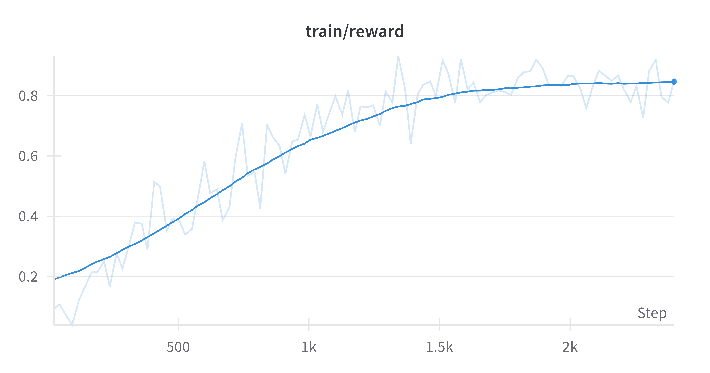
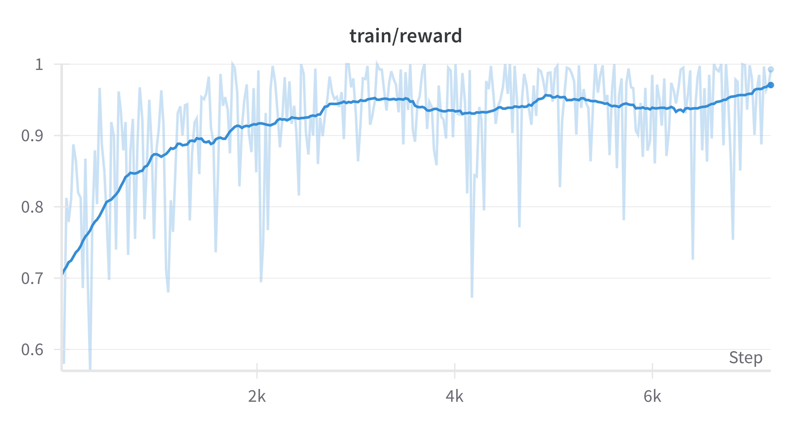
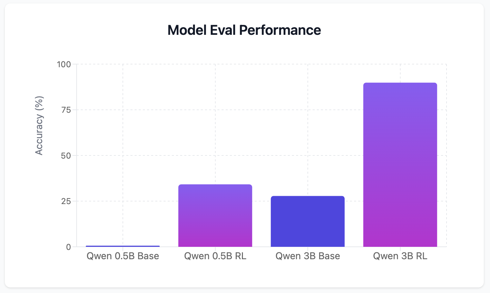
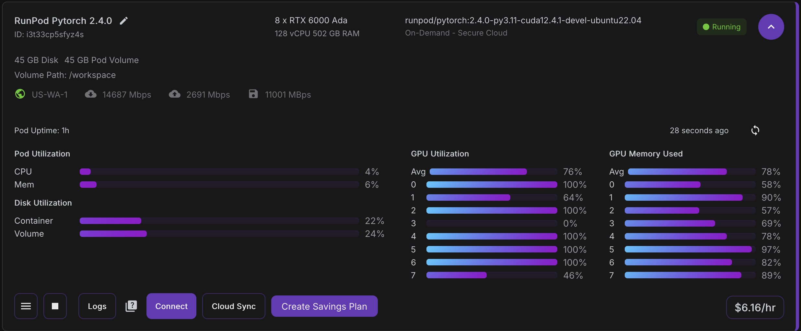
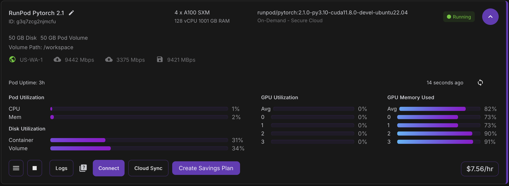

# 🔢 Calculator Agent Training with Multi-Turn Reinforcement Learning

**TL;DR:** I successfully trained Qwen 2.5 (both 0.5B and 3B variants) to use a slightly complex calculator tool through multi-turn reinforcement learning, achieving a **62% absolute increase in evaluation accuracy**. Final models are available on Hugging Face.

**Why train an LLM to use a calculator?**

Because despite their reasoning capabilities, LLMs struggle with arithmetic precision—even basic math can lead to errors.

---

## 📚 Table of Contents

- [High-Level Workflow Summary](#-high-level-workflow-summary)
- [Training Results](#-training-results)
  - [0.5B Model](#05b-model)
  - [3B Model](#3b-model)
- [Training & Rollout Details](#-training--rollout-details)
  - [Rollout Strategy](#-rollout-strategy)
  - [Key Training Configuration](#-key-training-configuration)
- [Reward Design](#-reward-design)
  - [LLM-as-a-Judge (Tool Use Evaluation)](#-llm-as-a-judge-tool-use-evaluation)
  - [Answer Verification](#-answer-verification)
- [Environment (Tools & State Management)](#-environment-tools--state-management)
  - [Calculator Tool](#-calculator-tool)
  - [Calculator Environment State](#-calculator-environment-state)
- [Evaluation Suite](#-evaluation-suite)
  - [Performance Improvements](#-performance-improvements)
- [Hardware & Cost Efficiency](#-hardware--cost-efficiency)
  - [0.5B Training Setup](#05b-training-setup)
  - [3B Training Setup](#3b-training-setup)
- [Dataset Details](#-dataset-details)
  - [Example Dataset](#-example-dataset)
  - [Dataset Generation Methodology](#-dataset-generation-methodology)
- [Models Available on Hugging Face](#-models-available-on-hugging-face)
- [Setup](#-setup)
  - [For local dev](#for-local-dev)
  - [Deployment](#deployment)
  - [When deployed onto a training node](#when-deployed-onto-a-training-node)
  - [Deployment issue fixes](#deployment-issue-fixes)
- [Acknowledgements](#-acknowledgements)
---

## 🧠 High-Level Workflow Summary

1. Crafted and iterated on a tailored [system prompt](./src/inference/calculator_system_message.md) 
2. Implemented [custom environment logic](./src/environment/) (tools & state handling)  
3. Built a dedicated evaluation dataset
4. Conducted pre-Reward Model evaluations on Qwen 2.5 (0.5B & 3B)  
5. Designed and refined a **hybrid reward function** using both [LLM-as-a-judge](./src/rewards/tool_judge.md) and [code verification](./src/rewards/verifiers/answer_verifier.py)  
6. Generated [training data](./datasets/calculator_train.csv)
7. Developed training pipeline leveraging the [verifiers](https://github.com/willccbb/verifiers/tree/main) framework  
8. Iteratively improved reward signal
9. Executed successful RL fine-tuning runs  

---

## 📈 Training Results

Below is a visualization of the reward improvement over time for two model sizes.

### 0.5B Model
- Starts at ~0.2 reward  
- Ends above **0.8 reward**

### 3B Model
- Begins at **0.7 reward**  
- Peaks near **perfect reward (~1.0)**




---

## 🔄 Training & Rollout Details

This project leveraged **Group Relative Policy Optimization (GRPO)**, a novel algorithm designed for preference-aligned policy updates using group-level comparisons. GRPO encourages the model to learn from relative advantages within a group of sampled responses, making it particularly well-suited for structured reasoning tasks.

### 🔁 Rollout Strategy
- **8 samples per training prompt**, each generated with a **temperature of 0.9** to encourage diversity while maintaining coherence.
- All rollouts were performed using a **vLLM server** hosted locally during training.

### ⚙️ Key Training Configuration
- **Algorithm**: GRPO (Group Relative Policy Optimization)
- **Batch Size**: 8 generations/device (total batch scaled by GPU count)
- **Learning Rate**: 1e-6
- **Training Epochs**: 1 full pass through the dataset
- **Policy Updates**: 2 GRPO iterations per training step
- **Reward Model**: Hybrid signal combining LLM-as-a-judge and code-based verification
- **Gradient Clipping**: Max norm = 0.1
- **Precision**: bfloat16 enabled for efficiency
- **Logging & Monitoring**: WandB + detailed completion logging
- **Generation Constraints**:  
  - Max prompt length: 1024 tokens  
  - Max completion length: 500 tokens

---

## ⚖️ Reward Design

To provide meaningful supervision during RL, rewards were computed using **two complementary methods**:

### 🤖 LLM-as-a-Judge (Tool Use Evaluation)
- Used **Claude-3.5-Haiku** as an external judge
- Provided a carefully crafted [scoring rubric](./src/rewards/tool_judge.md)
- Encouraged nuanced feedback beyond simple pass/fail judgments

### ✅ Answer Verification
- Each sample had a known correct result
- Regex matching was used to extract final answers
- Verified correctness via programmatic comparison

---

## 🛠️ Environment (Tools & State Management)

### 🧮 Calculator tool
The agent was asked to output both XML and YAML to use the calculator. The YAML structure was recursive.

For example the prompt: "What's the sum of 987 times 654, and 987 divided by the total of 321 and 11?" should induce this model output:
```
<calculator>
operation: add
operands:
  - operation: multiply
    operands:
      - 987
      - 654
  - operation: divide
    operands:
      - 987
      - operation: add
        operands:
          - 321
          - 11
</calculator>
```

This output is [parsed](./src/environment/calculator_env.py) into Python code, [calculated](./src/environment/tools/calculator.py), and then the environment response is shown to the model as:

```
<output>
645500.9728915663
</output>
```

The model is then asked to formulate a final response to the user.

### 👀 Calculator Environment State
There was no need for a state as this was a simple tool calling environment.

---

## 🧪 Evaluation Suite

A custom benchmark suite built using the `agentic_environments` [library](https://github.com/Danau5tin/agentic_environments). The eval dataset is [here](https://github.com/Danau5tin/agentic_environments/blob/qwen/examples/calculator_agent/datasets/basic_calculations_eval.csv), and the inference code [here](https://github.com/Danau5tin/agentic_environments/blob/qwen/examples/calculator_agent/evaluation/runner.py).

### Performance Improvements

| Model Size | Pre-RL Accuracy | Post-RL Accuracy | ▲ Increase |
|------------|------------------|-------------------|-------------|
| 0.5B       | 0.6%             | **34%**           | +33.4 pts   |
| 3B         | 27%              | **89%**           | +62 pts     |



---

## 💻 Hardware & Cost Efficiency

### 0.5B Training Setup

- **Inference:** 2x RTX6000 Ada
- **Training:** 6x RTX6000 Ada
- **Total Time:** 2h 56m 9s  
- **GPU Cost:** $18.04 (~£13.47)

### 3B Training Setup

- **Inference:** 2x A100 (80GB)
- **Training:** 2x A100 (80GB)
- **Total Time:** 3h 6m 51s  
- **GPU Cost:** $23.51 (~£17.55)

---

## 🗂️ Dataset Details

Both the [eval dataset](https://github.com/Danau5tin/agentic_environments/blob/qwen/examples/calculator_agent/datasets/basic_calculations_eval.csv) & the [training dataset](./datasets/calculator_train.csv) were synthetically generated using this process.

### Example dataset
```csv
question,expression,answer
"What is 4829 multiplied by 736?", 4829*736,3554144.0
```

### Dataset Generation Methodology
Firstly, Gemini-2.5-Pro was prompted with relevant context and instructions to generate a very diverse dataset. It was instructed to diversify in the following ways:
- The way a question was asked (e.g: "Find the product", "What do you get when", etc..)
- The complexity of the question

It's guidelines were:
- Operations must be addition, subtraction, division and multiplication.
- Questions should at least be very / extremely hard for an average human to work out in their heads without the use of a calculator.

Gemini-2.5-Pro was asked to generate only the "question" & "expression" columns. This is to avoid relying on an LLM to find the correct answer. Instead the answer column was generated using a simple python script that accepted the csv as input, and ran `eval()` on each expression column to generate the "answer" column.

The eval dataset was made specifically to cover all the various scenarios covered in the training dataset.

---

## 📦 Models Available on Hugging Face

✅ Both trained models are now publicly accessible:

- 🔗 [Qwen 2.5 0.5B – Calculator Agent](https://huggingface.co/Dan-AiTuning/calculator_agent_qwen2.5_0.5b)
- 🔗 [Qwen 2.5 3B – Calculator Agent](https://huggingface.co/Dan-AiTuning/calculator_agent_qwen2.5_3b)

---


## Setup

### For local dev
As a temp solution whilst [verifiers](https://github.com/willccbb/verifiers) is not on PyPI, clone verifiers at the same level as calculator_agent_rl.
```
 -
  |
   -- calculator_agent_rl/
   -- verfifers/
```
This is required in order to access the verifiers lib.

Use the devcontainer and Dockerfile for development. If using VSCode this should popup automatically.

### Deployment
0. Rent GPU from somewhere like runpod and connect via SSH
1. Install uv `curl -LsSf https://astral.sh/uv/install.sh | sh`
2. Open workspace dir & Clone repo into `/workspace` `git clone https://{githubaccess_token}@github.com/AiTuning-Ltd/{repo}.git`
3. Clone verifiers into `/workspace` `git clone https://github.com/willccbb/verifiers.git`
4. Follow when deployed steps below

#### When deployed onto a training node
**The below example code runs Qwen 2.5 3B on 8x GPUs (x4 for inference, x4 for training)**
1. Run `uv sync` after the verifiers repo is cloned too as mentioned above.
2. Run `uv add flash-attn --no-build-isolation`
3. Ensure .env file is set at the root of the project
4. Run vLLM server (Example for a x4 GPUs):
    a. `cd ../verifiers`
    b. `CUDA_VISIBLE_DEVICES=0,1,2,3 python verifiers/inference/vllm_serve.py --model "Qwen/Qwen2.5-3B-Instruct" --tensor_parallel_size 4 --max_model_len 8192  --gpu_memory_utilization 0.9 --enable_prefix_caching True`
5. Run train.py using accelerate (Example on x4 GPUs):
`CUDA_VISIBLE_DEVICES=4,5,6,7 accelerate launch --num-processes 4 --config-file ../verifiers/configs/zero3.yaml src/train.py`

#### Deployment issue fixes

**If GPUs hang at 100% utilisation for both vLLM or training script initialisation**
0. Ensure you are using CUDA version 12.4+
1. Stop the processes
2. In the terminal: `export NCCL_P2P_DISABLE=1`. Fix found [here](https://github.com/vllm-project/vllm/issues/14449#issuecomment-2739372704)
3. Re-run script

**If error in verfiers package about `"question"`**
1. Go to `data_utils.py` in verifiers and change `"question"` to `'question'` on lines 118 & 132

**If Anthropic API key is not loading onto each GPU for judge**
1. Go to `claude.py` & change `Anthropic()` to `Anthropic(api_key="{api_key}")`


## 📚 Acknowledgements

This project makes use of the [Verifiers](https://github.com/willccbb/verifiers) library for reinforcement learning in verifiable environments. If you use this code in your research, please cite:

```
@article{brown2025verifiers,
  title={Verifiers: Reinforcement Learning with LLMs in Verifiable Environments},
  author={Brown, William},
  year={2025}
}
```